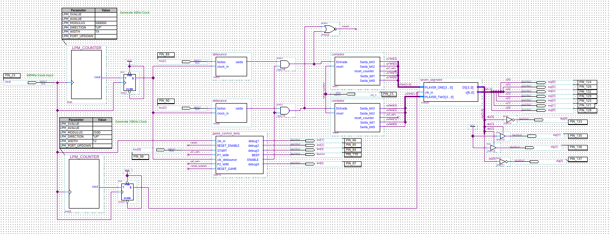
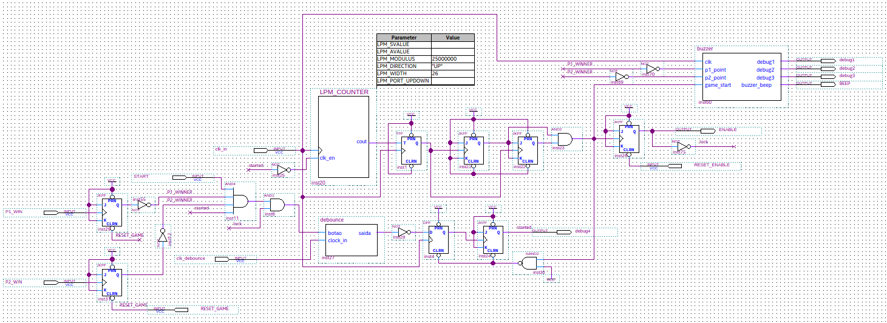
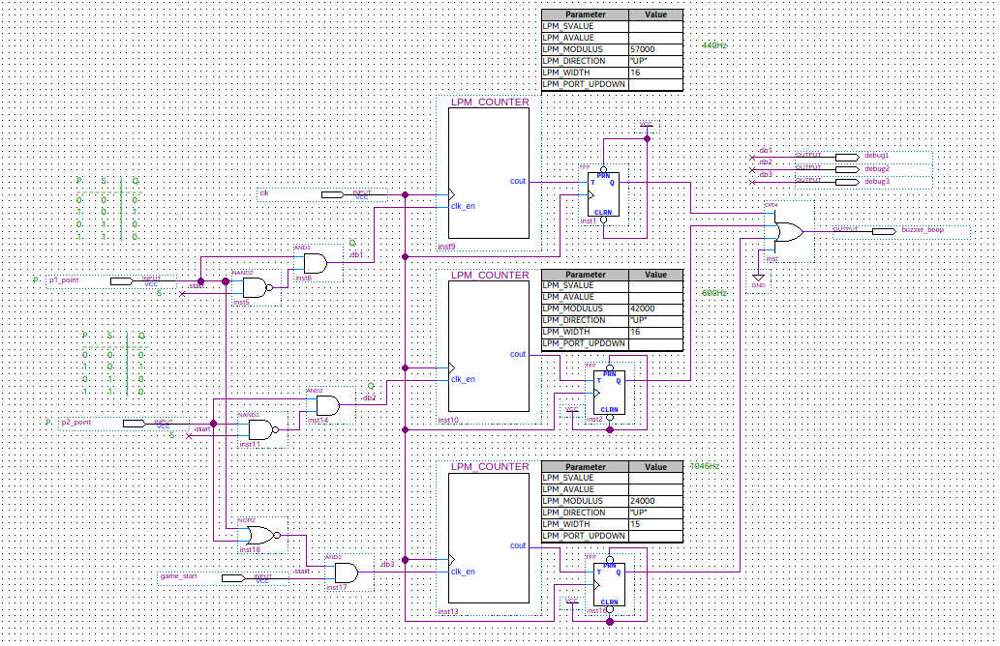
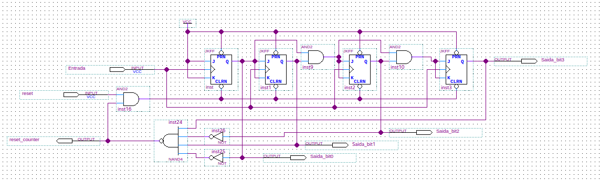
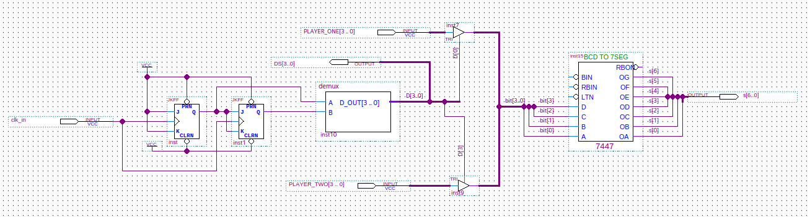
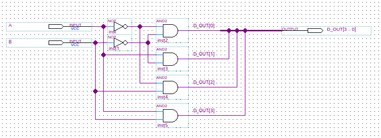
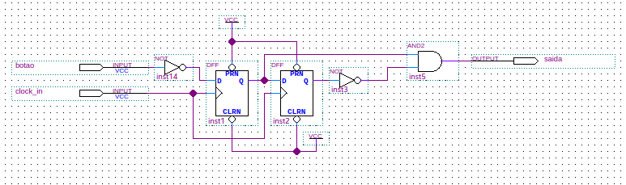

# Resumo do Projeto

Projetar um sistema digital em FPGA através de circuitos lógicos (arranjos de 
portas  lógicas,  flip-flops,  etc.)  utilizando  a  ferramenta  Quartus. A ideia do 
jogo é que, ao disponibilizar  uma informação no display de 7 segmentos, dois jogadores 
pressionem uma tecla, o primeiro  que  pressionar  ganha  um ponto. O display de 7 segmentos 
deve, além de  indicar o início da competição, deve informar o número de pontos de cada jogador. 
O  jogador que chegar a 10 pontos primeiro ganha o jogo. Caso o vencedor seja o jogador 1, um 
som deve ser emitido e a pontuação deve ser mostrada no display de 7 segmentos, caso o jogador 2 
vença, deve-se emitir um som mais grave (diferente do jogador 1). Deve-se  ter  um  botão  para  
dar  início  ao  jogo  e  esperar  um  tempo  (que  pode  ser aleatório) para iniciar a competição.

## Definições Funcionais

- Utilizar os displays de 7 segmentos, para informar o início da competição e para armazenar a pontuação dos dois jogadores;

- Gerar 4 frequências audíveis distintas a serem reproduzidas pelo buzzer: por exemplo: 440Hz, 600hz, 740Hz, e 1046Hz;

- Após iniciar o jogo, apresentar a informação no display, o buzzer deve emitir som  agudo por um tempo, e depois o sistema passa a esperar o acionamento de uma tecla pelos jogadores; 

-  Caso o jogador 1 vença, deve-se emitir um som e incrementar o contador de pontos do jogador 1. Caso o jogador 2 vença, o mesmo deve ser realizado, porém o som deve ser diferente; 

- O jogador que chegar em 10 pontos primeiro vence e uma informação deve ser apresentada no display e um som deve ser tocado.

## Top

## Game Control

## Buzzer

## 4 Bits Counter

## 7 Segments Display

## Demux 2:4

## Debounce
